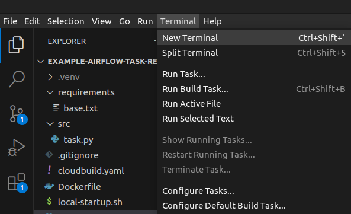
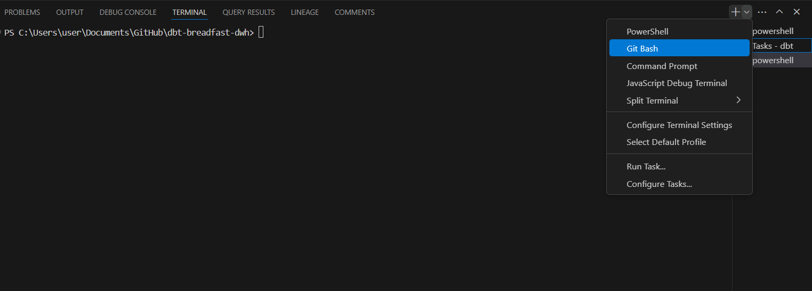

## Motivation 

This repo is aimed to be a template for creating an airflow task (*can be extended to any python task not just for airflow*) that needs to be packaged as a docker image and run in a container on a Kubernetes Pod.

## Contents

1. [`README.md`](README.md) and [`docs/`](docs/) folder for documentation.
2. Template [`gitignore`](.gitignore) file.
3. Template [`requirements/base.txt`](requirements/base.txt) file for listing python package dependencies.
4. Template [`src/task.py`](src/task.py) file for writing the main python code.
5. Template [`local-startup.sh`](local-startup.sh) file for setting up the local environment for local testing.
6. Template [`Dockerfile`](Dockerfile) for building the repo as Docker image.
7. Template [`cloudbuild.yaml`](cloudbuild.yaml) that references [`Dockerfile`](Dockerfile) and build this Dockerfile into a Docker image then pushes it to our Google Artifact Registry. 

## Usage

To use this template repo you can clone it locally. Then copy/paste it elsewhere, rename it, edit it as fits your needs.

## Additional Steps for Local Testing when using GCP Libraries

Example GCP libraries:
- google-cloud-bigquery
- google-cloud-storage

When locally testing a piece of code that calls a gcloud API (e.g. BigQuery, GCS), the machine running the code need to be first authenticated against such gcloud API. To make all gcloud API calls get executed seamlessly when running the code locally, one has to setup [Google Application Default Credentials](https://cloud.google.com/docs/authentication/application-default-credentials). After setup gcloud libraries will automatically use these credentials to authenticate against gcloud APIs.  

Use [`local-startup.sh`](local-startup.sh) as a shortcut to abstract the needed steps for the setup. Find the guid to run a `.sh` script [here](#how-to-run-a-sh-file)

## Additional Steps for using Private Python Packages

Example private python package:
- [pybq](https://github.com/Breadfast/pybq)

Python packages can be either publicly hosted on e.g. PyPi or privately hosted on another package registry e.g. a private [Google Artifact Registry](https://cloud.google.com/artifact-registry/docs/python).

Installing a private registry requires an additional step. This step is to add an extra index for pip to search for the requested package to be installed as mentioned in the [docs](https://pip.pypa.io/en/stable/cli/pip_install/#finding-packages).

You can find a guide ot install `pybq` package [here](https://github.com/Breadfast/pybq/blob/main/README.md). 

You can find the steps to install such package abstracted and *commented out* in :
1. [`local-startup.sh`](local-startup.sh)
2. [`Dockerfile`](Dockerfile)
3. [`requirements/base.txt`](requirements/base.txt)

For local testing run the commented lines in [`local-startup.sh`](local-startup.sh). 

For deployment don't forget to **uncomment** the relevant lines in [`Dockerfile`](Dockerfile) and [`requirements/base.txt`](requirements/base.txt).

## How to Run a .sh file 

- For Windows: Go through steps 1-3. 
- For Linux: Open any terminal in the project directory and Use step 3.  

1. Open new Terminal



2. Use Git Bash Terminal




3. Run the Provided Shell Script


    ```bash
    . local-startup.sh
    ```
